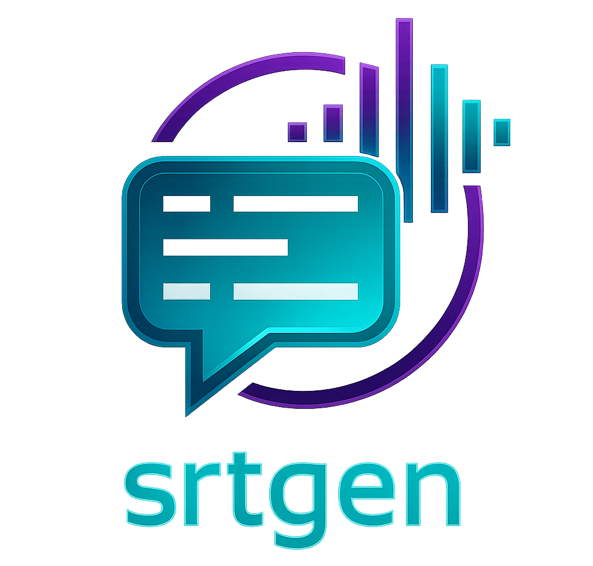

<p align="center">
  
</p>

# srtgen - Video Captions Generator CLI

This project provides a small cross-platform CLI wrapper that uses existing  tools to:

- generate an `.srt` file from a video
- generate an `.srt` file and embed it into an MP4 output

The CLI tool uses:

- OpenAI Whisper CLI for speech-to-text / SRT generation
- FFmpeg for subtitle embedding

## What this wrapper does

- generates an `.srt` caption file from a video or audio file
- optionally embeds the captions into a separate MP4 output using FFmpeg
- optionally replaces the input video itself with the captioned MP4 via `--overwrite-original`
- keeps the transcription and embedding logic delegated to Whisper and FFmpeg

## CLI usage

```bash
node src/cli.js transcribe ./input.mp4
node src/cli.js transcribe ./input.mp4 --embed
node src/cli.js transcribe ./input.mp4 --embed --overwrite-original
node src/cli.js transcribe ./input.mp4 --output-dir ./out --model base
node src/cli.js transcribe ./input.mp4 --language en
```

### Option reference

The CLI supports these flags after the `transcribe` command:

- `--embed` - create an MP4 with the `.srt` embedded as a selectable subtitle track
- `--overwrite-original` - replace the input video itself with the captioned MP4 (opt-in)
- `--output-dir <path>` - write the generated `.srt` file to a specific folder; the default is beside the input video
- `--model <name>` - choose the Whisper model to use for transcription
  - default: `turbo`
  - examples: `tiny`, `base`, `small`, `medium`, `large`, `turbo`
  - smaller models are faster and lighter; larger models are usually more accurate
- `--language <code>` - optional language hint for Whisper (for example `en`, `fr`, `es`)
- `--help`, `-h` - show the built-in help text and supported flags

The wrapper validates option values, so missing values for `--output-dir`, `--model`, or `--language` will fail with a clear error instead of producing a broken Whisper command.

The wrapper passes `--model` straight through to Whisper, so the available model names come from Whisper itself.

After installing the wrapper globally with npm, you can use:

```bash
srtgen transcribe ./input.mp4
srtgen transcribe ./input.mp4 --embed
srtgen transcribe ./input.mp4 --embed --overwrite-original
srtgen transcribe ./input.mp4 --help
```

## Required tools

### 1. FFmpeg

Install FFmpeg first because both the transcription step and embed step depend on it.

#### macOS (Homebrew)

```bash
brew install ffmpeg
```

#### Windows (Winget)

```powershell
winget install Gyan.dev.FFmpeg
```

#### Linux (Ubuntu/Debian)

```bash
sudo apt update
sudo apt install -y ffmpeg
```

#### Linux (Fedora)

```bash
sudo dnf install -y ffmpeg
```

### 2. Python 3.10+

The Whisper CLI is easiest to install with Python.

#### macOS

```bash
brew install python
```

#### Windows

```powershell
winget install Python.Python.3.12
```

#### Linux

```bash
sudo apt update
sudo apt install -y python3 python3-pip
```

### 3. Whisper CLI

Install the OpenAI Whisper CLI:

```bash
pip install -U openai-whisper
```

If you prefer a local/offline path later, Whisper.cpp can also be evaluated as a backend option.

## Install the wrapper CLI

Clone the repo:

```bash
git clone https://github.com/danwahlin/srtgen.git
cd srtgen
```

Install the project dependencies:

```bash
npm install
```

To make the `srtgen` command available anywhere on your system, install the wrapper globally from the project root:

```bash
npm install -g .
```

Verify that the command is available:

```bash
srtgen --help
```

Then you can run:

```bash
srtgen transcribe ./input.mp4
srtgen transcribe ./input.mp4 --embed
srtgen transcribe ./input.mp4 --embed --overwrite-original
srtgen transcribe ./input.mp4 --help
```

## Current implementation notes

The CLI is implemented as a small Node.js wrapper that:

- checks for `whisper` or `python -m whisper`
- checks for `ffmpeg` when `--embed` is used
- creates an `.srt` file in the chosen output folder by default
- leaves the original input video untouched unless `--overwrite-original` is passed
- optionally embeds the `.srt` into an MP4 as a subtitle track with FFmpeg

This keeps the transcription pipeline on top of existing OSS tools instead of reimplementing speech recognition.
