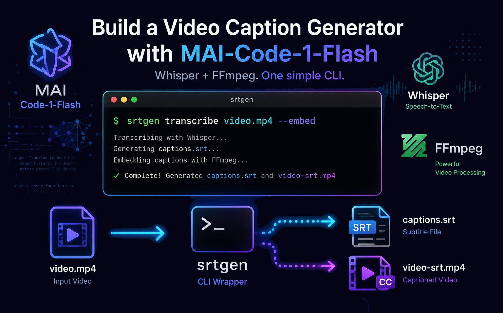

# Building a Custom Video Captions Generator CLI Using MAI-Code-1-Flash in Copilot CLI


I started this project for a very practical reason: I wanted a simple way to generate SRT captions from a video and, if needed, turn that into a captioned MP4. Nothing fancy. Just a workflow that saves me time and avoids running multiple tools. A secondary goal was to learn more about the capabilities of the new [MAI-Code-1-Flash model](https://microsoft.ai/models/mai-code-1-flash/) and see what it was capable of doing.

MAI-Code-1-Flash helped me research the existing OSS options, create a planning document, sketch the wrapper, implement the CLI, fix the FFmpeg path when the embed step broke, update the docs, and make the command-line behavior clearer. 

The end result is a tiny Node.js CLI called [`srtgen`](https://github.com/danwahlin/srtgen). It wraps two tools that already do the hard work well:

- Whisper for speech-to-text and SRT generation
- FFmpeg for embedding captions into MP4 output

I wanted to use proven tools, not rebuild them from scratch which is why I ended up using Whisper and FFmpeg. But, could a smaller model like MAI-Code-1-Flash be used for some of the tasks? The short answer is yes, but let's walk through more details about the project first.

## What the CLI Actually Does

The SRT generator CLI supports two main features:

1. Generate an SRT file only
2. Generate an SRT file and also create a captioned MP4

By default, the original video stays untouched. The captioned MP4 gets written as a separate file with the `-srt.mp4` suffix. If you want to replace the source video itself, there's an opt-in flag for that.

The command shape is simple:

```bash
srtgen transcribe ./input.mp4 # Generate an SRT file
srtgen transcribe ./input.mp4 --embed # Generate an SRT file and a captioned MP4
srtgen transcribe ./input.mp4 --embed --overwrite-original # Generate an SRT file and a captioned MP4, replacing the original video
```



That is the whole point of the project. It makes a useful workflow repeatable and easy to use versus running multiple tools independently.

## The Prompts That Shaped It

The model helped with the usual sequence of steps:

- research existing OSS caption tools
- create a plan for a CLI wrapper instead of writing custom ASR logic
- implement the wrapper and wire up the command flow
- fix the embed path when FFmpeg in this environment did not behave the way I expected
- review the code and tighten the CLI behavior
- update the documentation in the project's readme

While MAI-Code-1-Flash generated the initial code in one-shot, the iterative process of refining and debugging the code was necessary to get to the final result. This was not a one-shot “generate code” moment which experience shows doesn't happen that often aside from simple tasks. It was a normal build cycle with real debugging, real choices, and real output.

## Why MAI-Code-1-Flash Made Sense Here

This was not a project that needed a giant reasoning model. It needed something fast, practical, and useful. That is where Flash models have a real advantage.

They are good for:

- quick research and option comparison
- small implementations that are easy to test
- debugging command-line behavior and observing the results
- documentation updates
- refining flags and UX

The model did not need to be perfect at every step. It just needed to keep making solid progress.

## The Command-Line Flags

The CLI is small, but the flags are useful:

- `--embed` — create a captioned MP4 in addition to the SRT file
- `--overwrite-original` — replace the input video itself with the captioned version
- `--output-dir <path>` — write the SRT to a custom folder
- `--model <name>` — pass the Whisper model name through directly (e.g., `tiny`, `base`, `small`, `medium`, `large`)
- `--language <code>` — provide a Whisper language hint (default: `en`)
- `--help` / `-h` — show the built-in usage text

The default behavior is intentionally safe: generate the SRT and leave the original video alone. If you want to replace the source file, that is a deliberate choice.

## What I Liked About the Result

What I liked most is that the project stayed focused. It does one job well:

- transcribe a video
- write an SRT
- optionally embed captions into an MP4

It does not try to be a full video editing suite. It does not pretend to replace Whisper or FFmpeg. It just makes those tools easier to use in one repeatable workflow. That is often more valuable than something bigger and more abstract.

## Why This Matters for Flash Models

This project is a good example of what a Flash model can do well. It is not the “look, it built a whole app” story. It is the more useful story: a model helped turn a practical need into a working CLI, faster than I would have done alone.

A Flash model is not only for quick answers. It can support real engineering work when the task is focused and well-defined, the tools are already known, and the goal is to make something useful. This project ended up being exactly that: a lightweight wrapper around existing tools, with a clean output path and real value for anyone who needs captions from video.

To sum it up, MAI-Code-1-Flash helped me build a useful captioning tool around Whisper and FFmpeg, and the result is something you can run locally without reinventing the pipeline. All done without relying on a large, complex, and more expensive model.

**SRT-Generator** Repo: https://github.com/DanWahlin/srt-generator
